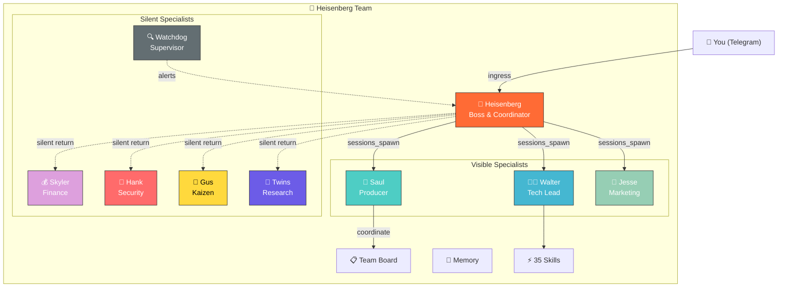

# 🧪 Heisenberg Team

**A multi-agent system with 9 AI agents working as a team.** Built on [OpenClaw](https://github.com/openclaw/openclaw). Inspired by Breaking Bad.

Production-ready: universal installer, multi-provider support, orchestration with visibility policy.

[](LICENSE)
[](https://github.com/openclaw/openclaw)
[]()
[]()

---

## Table of Contents

- [What is this?](#what-is-this)
- [Why?](#why)
- [How is this different?](#how-is-this-different)
- [Architecture](#architecture)
- [Agents](#agents)
- [Quick Start](#quick-start)
- [Skills (34)](#skills-34)
- [Project Structure](#project-structure)
- [Examples](#examples)
- [Documentation](#documentation)
- [Contributing](#contributing)
- [License](#license)

---

## Requirements

- [Node.js](https://nodejs.org/) v20+
- [OpenClaw](https://github.com/openclaw/openclaw) (`npm install -g openclaw`)
- Auth for at least one LLM provider (Anthropic, OpenAI, Google, DeepSeek, OpenRouter, or local models)
- Telegram bot token (optional, for notifications via [@BotFather](https://t.me/BotFather))

### System Requirements

| | Minimum | Recommended |
|---|---------|-------------|
| RAM | 2 GB | 4 GB (9 agents) |
| Disk | 500 MB | 2 GB (with logs/memory) |
| OS | macOS 11+, Ubuntu 20.04+, Windows 11 (WSL2) | macOS 13+ or Ubuntu 22.04+ |
| Node.js | 20.x+ | 20.x+ |
| Network | Required (LLM API calls) | Broadband |

## What is this?

A production-ready template for running a **team of AI agents** that communicate, delegate tasks, and deliver results. Each agent has a defined role, personality, and set of skills.

This is not a framework. This is a **working system** you can clone, configure, and run.

## Why?

- **One boss, seven specialists.** You talk to Heisenberg. He delegates to the right agent. You get results.
- **34 skills.** PDF generation, research, marketing, security audits, financial tracking, code review — out of the box.
- **Board-First protocol.** Tasks survive crashes. File-based state, not memory. No work is lost.
- **Self-healing.** Health checks, watchdogs, automatic session cleanup. The system monitors itself.
- **Your data stays yours.** All personal data uses `{{PLACEHOLDER}}` format. Setup wizard fills them in 5 minutes.

## How is this different?

| Feature | Heisenberg Team | AutoGPT | CrewAI | MetaGPT |
|---------|----------------|---------|--------|---------|
| Setup | 5-min wizard | Manual YAML | Python code | Python code |
| Crash recovery | File-based board survives restarts | In-memory, lost on crash | In-memory | In-memory |
| Agent coordination | Board-First protocol + sessions_send | Shared memory | Sequential/hierarchical | SOP-based |
| Self-healing | Built-in (cron-based) | No | No | No |
| Skills library | 34 ready-to-use | Plugin ecosystem | Build your own | Build your own |
| Personality | Persistent SOUL.md per agent | Generic | Role description | Role description |
| Memory | SQLite + vector search + file-based | Vector DB | Short-term only | Shared memory |
| Monitoring | Heartbeat + health checks | Logs only | Logs only | Logs only |
| Multi-platform | macOS + Linux + WSL | Docker | Python | Python |

## Architecture



## Agents

| Agent | Character | Role | Visible? | Key Skills |
|-------|-----------|------|----------|------------|
| **Heisenberg** | Walter White | Boss, user-facing | YES | Delegation, delivery |
| **Saul** | Saul Goodman | Coordinator | YES | Pipeline management, briefings |
| **Walter** | Walter White (lab) | Tech Lead | YES | Code, PDF, GitHub, skills |
| **Jesse** | Jesse Pinkman | Marketing | YES | Funnels, campaigns, analytics |
| **Skyler** | Skyler White | Finance | NO | DOCX, XLSX, contracts |
| **Hank** | Hank Schrader | Security/QA | NO | Audits, monitoring |
| **Gus** | Gus Fring | Kaizen | NO | Crons, self-improvement |
| **Twins** | Salamanca Twins | Research | NO | Deep research, web analysis |
| **Watchdog** | — | Supervisor | NO | Stuck sessions, health alerts |

## Quick Start

```bash
# 1. Clone
git clone https://github.com/rubezhanin/heisenberg-team.git
cd heisenberg-team

# 2. One-command install (recommended)
bash install.sh

# That's it. install.sh runs:
#   - bootstrap-install.sh (system deps, Node.js, OpenClaw)
#   - setup-wizard.sh (providers, models, API keys, agents)
#   - init-workspace.sh (workspace directories)
#   - smoke-test.sh (verification)
```

For non-interactive/VPS deployment:

```bash
bash install.sh --yes
```

The setup wizard supports:
- 7 LLM providers (Anthropic, OpenAI, Google, DeepSeek, OpenRouter, Ollama, custom)
- 2 embedding providers (OpenAI, Ollama)
- 2 voice transcription options (Groq API, local whisper.cpp)
- per-agent Telegram bot tokens
- language selection (EN/RU)
- gateway auto-start (systemd/launchd)
- selected agents only

See [SETUP.md](SETUP.md) for detailed installation guide or [docs/first-task.md](docs/first-task.md) for your first walkthrough.

> **Language note:** Agent personalities and team protocols are in Russian. The architecture works in any language — edit `SOUL.md` and `AGENTS.md` in each agent to change language.

> **Platform note:** Utility scripts in `scripts/` are optimized for macOS but support Linux/WSL. See [Linux Setup](docs/linux-setup.md) for platform-specific instructions.

## Skills (35)

The team shares a library of 35 skills covering:

- **Content:** copywriter, youtube-seo, presentation, pptx-generator
- **Research:** researcher, deep-research-pro, channel-analyzer, reddit
- **Documents:** minimax-pdf, minimax-docx, minimax-xlsx, nano-pdf
- **Development:** coding-agent, cursor-agent, github-publisher
- **Automation:** n8n-workflow-automation, blogwatcher, browser-use
- **Analysis:** analytics, audit-website, business-architect
- **Specialized:** family-doctor, auto-mechanic, dog-kinolog, astrologer, weather

Full list with dependencies in [skills/README.md](skills/README.md).

## Project Structure

```
heisenberg-team/
├── agents/          # 9 agents (8 + watchdog), each with config files
├── skills/          # 35 shared skills
├── scripts/         # Utility and automation scripts
├── configs/         # OpenClaw config templates
├── references/      # Team constitution, standards
├── examples/        # Cookbooks and guides
├── docs/            # Architecture, FAQ
├── install.sh       # Universal installer (single entry point)
└── IMPROVEMENTS.md  # Full changelog of all changes
```

### 🤖 Deploy Full Team

Want all 9 agents working together? See the [Multi-Agent Deployment Guide](docs/deploy-agents.md).

```bash
bash install.sh    # One command does everything
```

## Examples

- [Add a new agent](examples/add-new-agent.md)
- [Create a skill](examples/create-skill.md)
- [Configure cron jobs](examples/configure-crons.md)

## Documentation

- [Your First Task](docs/first-task.md) - step-by-step walkthrough
- [Upgrade from Single Agent](docs/upgrade-from-single-agent.md) - migrate from single-agent setup
- [Supported Providers](SETUP.md#supported-llm-providers) - Anthropic, OpenAI, Google, DeepSeek, OpenRouter, Ollama
- [Agent Onboarding](docs/agent-onboarding.md) - configure agents on first launch
- [Architecture](docs/architecture.md) - how agents communicate
- [Agent Roles](docs/agent-roles.md) - what each agent does
- [Linux Setup](docs/linux-setup.md) - running on Ubuntu/Debian/Alpine/Fedora/Arch
- [FAQ](docs/faq.md) - common questions and troubleshooting
- [Skills Index](skills/README.md) - all 35 skills with dependencies
- [Improvements](IMPROVEMENTS.md) - full changelog of all changes

## Contributing

1. Fork the repo
2. Create a branch (`git checkout -b feature/new-agent`)
3. Commit changes (`git commit -m 'Add new agent'`)
4. Push (`git push origin feature/new-agent`)
5. Open a Pull Request

## License

[MIT](LICENSE)

---

## 🇷🇺 Русская версия

Полная документация на русском: [README.ru.md](README.ru.md)

---

*Built with [OpenClaw](https://github.com/openclaw/openclaw) - the open-source AI agent platform.*
